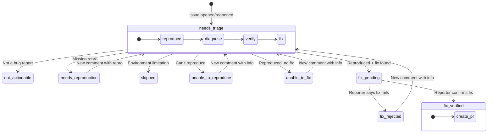

# triagebot-action

AI-powered issue triage bot for GitHub repositories. Uses a label-driven state machine to automatically reproduce bugs, diagnose root causes, attempt fixes, and verify them with reporters.

## How it works

When an issue is opened, the bot adds a triage label and runs an AI agent through a multi-stage pipeline: **reproduce** the bug, **diagnose** the root cause, **verify** it's actually a bug, and **attempt a fix**. If a fix is found, it pushes a branch, publishes a preview release, and asks the reporter to confirm. When they do, it creates a PR.

The entire flow is driven by a finite state machine encoded as GitHub labels. Each issue has exactly one triage label at any time, and transitions happen automatically based on events and AI classification.

### State Machine



### Label Reference

| Label | Meaning |
|-------|---------|
| `triage: needs triage` | Waiting for the triage agent to run |
| `triage: not actionable` | Not a bug report (feature request, discussion, etc.) |
| `triage: needs reproduction` | Missing reproduction or expected behavior description |
| `triage: skipped` | Cannot triage in CI (host-specific, unsupported runtime/version) |
| `triage: unable to reproduce` | Agent attempted reproduction but could not reproduce |
| `triage: unable to fix` | Bug reproduced and diagnosed, but no fix found |
| `triage: fix pending` | Fix pushed to branch, waiting for reporter confirmation |
| `triage: fix rejected` | Reporter says the proposed fix does not work |
| `triage: fix verified` | Reporter confirmed the fix works, PR created |

All label names are customizable via action inputs.

**Re-triageable labels** — when a new comment arrives on an issue with one of these labels, the bot evaluates whether the comment contains new actionable information and potentially re-runs triage:

- `triage: needs triage`
- `triage: needs reproduction`
- `triage: unable to reproduce`
- `triage: unable to fix`
- `triage: fix rejected`

**Terminal labels** — the bot takes no further action:

- `triage: fix verified`
- `triage: not actionable`
- `triage: skipped`

## Setup

### 1. Create a workflow

Add a single workflow file to your repository:

```yaml
# .github/workflows/triage.yml
name: Issue Triage

on:
  issues:
    types: [opened, reopened, closed]
  issue_comment:
    types: [created]

permissions: {}

concurrency:
  group: triage-${{ github.event.issue.number }}
  cancel-in-progress: false

jobs:
  triage:
    runs-on: ubuntu-latest
    timeout-minutes: 60
    permissions:
      contents: read
      issues: read
      id-token: write
    steps:
      - uses: actions/checkout@v4
        with:
          fetch-depth: 0
          persist-credentials: false

      - uses: withastro/triagebot-action@v1
        with:
          read-token: ${{ secrets.GITHUB_TOKEN }}
          write-token: ${{ secrets.BOT_GITHUB_TOKEN }}
          anthropic-api-key: ${{ secrets.ANTHROPIC_API_KEY }}
          skills-dir: .agents/skills/triage
```

### 2. Create triage skills

The action needs project-specific skill files that tell the AI agent how to work with your codebase. Create these in the directory specified by `skills-dir`:

```
.agents/skills/triage/
  SKILL.md          # Orchestration: defines the step order and early exits
  reproduce.md      # How to reproduce bugs in your project
  diagnose.md       # How to find root causes in your codebase
  verify.md         # How to distinguish bugs from intended behavior
  fix.md            # How to write and verify fixes
```

Each file is a markdown document with instructions for the AI agent. See the [Astro monorepo skills](https://github.com/withastro/astro/tree/main/.agents/skills/triage) for a complete example.

### 3. Set up tokens

The action uses two GitHub tokens:

- **`read-token`** — For reading issues, labels, and PRs. The default `GITHUB_TOKEN` works.
- **`write-token`** — For posting comments, pushing fix branches, creating PRs, and managing labels. This should be a GitHub App token or PAT with write access to issues and contents.

You also need an **`anthropic-api-key`** for the AI agent.

## Inputs

| Input | Required | Default | Description |
|-------|----------|---------|-------------|
| `read-token` | Yes | | GitHub token for reading issues/labels/PRs |
| `write-token` | Yes | | GitHub token for posting comments, pushing branches, creating PRs |
| `anthropic-api-key` | Yes | | Anthropic API key for LLM calls |
| `skills-dir` | Yes | | Path to triage skill `.md` files |
| `build-command` | No | | Command to build the project before triage |
| `triage-model` | No | `anthropic/claude-opus-4-6` | Model for the triage pipeline |
| `verification-model` | No | `anthropic/claude-sonnet-4-6` | Model for fix verification and retriage checks |

### Label inputs

All labels are customizable. These are the defaults:

| Input | Default |
|-------|---------|
| `label-needs-triage` | `triage: needs triage` |
| `label-not-actionable` | `triage: not actionable` |
| `label-needs-reproduction` | `triage: needs reproduction` |
| `label-skipped` | `triage: skipped` |
| `label-unable-to-reproduce` | `triage: unable to reproduce` |
| `label-unable-to-fix` | `triage: unable to fix` |
| `label-fix-pending` | `triage: fix pending` |
| `label-fix-rejected` | `triage: fix rejected` |
| `label-fix-verified` | `triage: fix verified` |
| `pr-label-fix-verified` | `fix verified` |

## Architecture

The action has two layers:

**Action-owned** — the state machine, GitHub API interactions, and LLM calls that drive the workflow:
- FSM routing based on event type and current label
- Re-triage evaluation (is there new actionable information?)
- Fix verification (did the reporter confirm the fix?)
- Comment generation from triage findings
- PR creation from verified fix branches
- Branch cleanup on issue close

**Project-owned** — the skill files that teach the AI agent about your specific codebase:
- How to set up and run reproductions
- How to navigate and instrument source code for diagnosis
- How to distinguish bugs from intended behavior
- How to write minimal fixes and tests

The action invokes project skills via [Flue](https://github.com/anthropics/flue), an agent orchestration framework. The AI agent runs shell commands on the GitHub Actions runner to build, test, and debug the project.

## Development

```bash
pnpm install
pnpm test          # Unit tests (router, labels)
pnpm test:evals    # LLM eval tests (requires ANTHROPIC_API_KEY)
pnpm build         # Bundle to dist/
pnpm lint          # Biome check
pnpm format        # Biome format
```
